# Admin redesign — Phase 1: three directions

Phase 1 of the admin redesign (#433, issue #446). It shows three genuinely different directions, each rendering the same four screens with the same fictional data, in light and dark, desktop and mobile. **The owner picks one (or one with named borrowings); Phase 2 builds the design-system foundation from that choice.**

| Direction                                                | Spec                              | Mockups                                                                                                                                                                                                 |
| -------------------------------------------------------- | --------------------------------- | ------------------------------------------------------------------------------------------------------------------------------------------------------------------------------------------------------- |
| **A — « Console »**: operator console, Linear-like       | [SPEC](phase-1/a-console/SPEC.md) | [accueil](phase-1/a-console/accueil.html) · [membres](phase-1/a-console/membres.html) · [nouveau concert](phase-1/a-console/nouveau-concert.html) · [fiche membre](phase-1/a-console/fiche-membre.html) |
| **B — « Atelier guidé »**: guided workspace, Stripe-like | [SPEC](phase-1/b-atelier/SPEC.md) | [accueil](phase-1/b-atelier/accueil.html) · [membres](phase-1/b-atelier/membres.html) · [nouveau concert](phase-1/b-atelier/nouveau-concert.html) · [fiche membre](phase-1/b-atelier/fiche-membre.html) |
| **C — « Canevas »**: focused canvas, Vercel-like         | [SPEC](phase-1/c-canvas/SPEC.md)  | [accueil](phase-1/c-canvas/accueil.html) · [membres](phase-1/c-canvas/membres.html) · [nouveau concert](phase-1/c-canvas/nouveau-concert.html) · [fiche membre](phase-1/c-canvas/fiche-membre.html)     |

**Viewing the mockups.** They are static HTML files. Open them in a browser from a checkout: add `?theme=dark` for dark mode, and `#confirm` on the fiche membre to see the deactivation dialog (`#palette` on A's accueil shows the command palette). Screenshots of every screen are in [`phase-1/shots/`](phase-1/shots/).

## What all three share

- **The approved IA** from Phase 0 (`00-inventory.md` section d): Accueil · Campagne 40 ans · Concerts et site public · Saison des membres · Membres et accès · Association, with the account menu holding Messages, Signaler un problème, the theme and Se déconnecter.
- **Look:** one accent, the brand teal (filled buttons on `#156c71` for AA contrast), neutral surfaces, semantic colours only for meaning, no gradients, Inter, a 5-step type scale, a 4 px grid, light and dark from the same tokens (contrast measured in each spec).
- **On every page:** an answer to where am I, what is this and what next; one filled primary action per screen.
- **Plain French:** "Parti·e · désactivé", "Diffère de la liste", "(facultatif)"; no enums.
- **Errors:** a summary linking to the fields, plus inline messages.
- **Destructive actions:** deactivation is a dialog that names Lucie, the consequences and that it can be undone; permanent deletion is superadmin-only and asks for the typed name.
- **Mobile:** 44 px targets at 390 px.
- **Built from** Next.js, Tailwind v4, the shadcn/Radix `components/ui` and lucide. No new UI library, with one exception flagged below.

## How they differ

|                        | A — Console                                                                              | B — Atelier guidé                                                                     | C — Canevas                                                                               |
| ---------------------- | ---------------------------------------------------------------------------------------- | ------------------------------------------------------------------------------------- | ----------------------------------------------------------------------------------------- |
| **Idea**               | Everything one keystroke or click away                                                   | Every screen explains itself; risky jobs are 3 steps                                  | One calm page at a time                                                                   |
| **Navigation**         | 232 px sidebar, collapsible to an icon rail; ⌘K palette                                  | 280 px sidebar, each section with a one-line description; "Vous êtes ici" trail       | No sidebar: top bar with the six sections as tabs; sub-pages as tabs under the title      |
| **Text size for data** | 13 px                                                                                    | 16 px                                                                                 | 14 px                                                                                     |
| **Density**            | High: 36 px rows                                                                         | Low by default (56 px rows), "Compactes" switch (44 px)                               | Medium: 56 px two-line rows                                                               |
| **Accueil**            | A prioritised inbox next to a compact agenda                                             | Tasks, then "Que voulez-vous faire ?" cards per job, campaign checklist with progress | "Aujourd'hui": one prioritised list, then what's coming, then the campaign                |
| **Membres list**       | True data table; row opens a split panel                                                 | Table with plain-language status; the sync shown as Vérifier · Choisir · Appliquer    | Clean rows; row opens a right-side sheet over the list                                    |
| **Concert form**       | Two columns with a live preview of the public card                                       | Sectioned, helper text under each field, live preview                                 | Single column in a sheet; no preview (no room)                                            |
| **Fiche membre**       | Full page; quick view in the split panel                                                 | Full page with provenance per field and a "Actions sensibles" card                    | Sheet with "Ouvrir en pleine page"; a reload gives the full page                          |
| **Keyboard**           | Rich: ⌘K, `/`, `J`/`K`, `X`, `C`, `O`, `[`; each also a visible button                   | Essentials: focus ring, `/`, Esc, Enter                                               | Essentials, plus skip link and arrow keys in menus                                        |
| **Best for**           | Weekly regulars doing volume                                                             | The once-a-month volunteer who must succeed alone                                     | The volunteer on a phone doing one thing                                                  |
| **Risk**               | Density and shortcuts intimidate occasional users                                        | Taller pages and more copy to keep true                                               | Less overview; campaign two clicks deep; URL-synced sheets are the hardest piece to build |
| **Extra dependency**   | ⌘K needs `cmdk` (shadcn's `command`): **a new runtime dependency, needs the owner's OK** | none                                                                                  | none                                                                                      |

## The four screens side by side (desktop, light)

**Accueil**

| A — Console                                                       | B — Atelier guidé                                                 | C — Canevas                                                      |
| ----------------------------------------------------------------- | ----------------------------------------------------------------- | ---------------------------------------------------------------- |
| 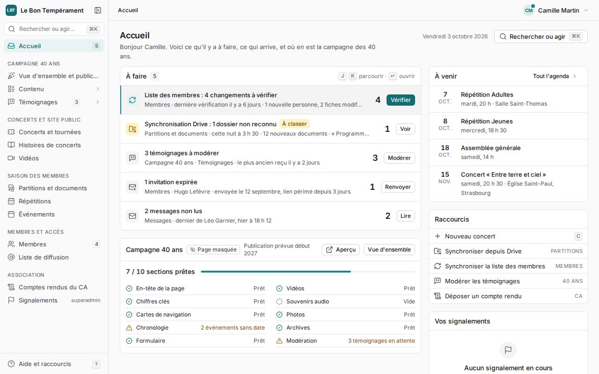 | 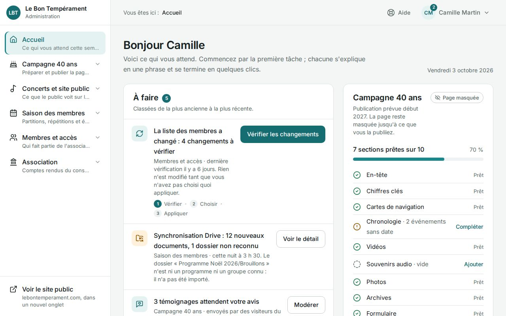 | 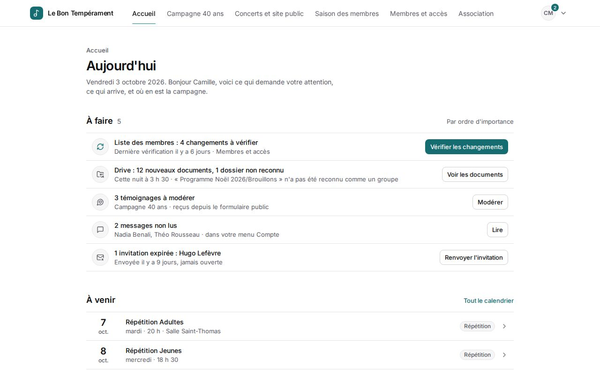 |

**Membres** (3 rows selected)

| A — Console                                                       | B — Atelier guidé                                                 | C — Canevas                                                      |
| ----------------------------------------------------------------- | ----------------------------------------------------------------- | ---------------------------------------------------------------- |
| 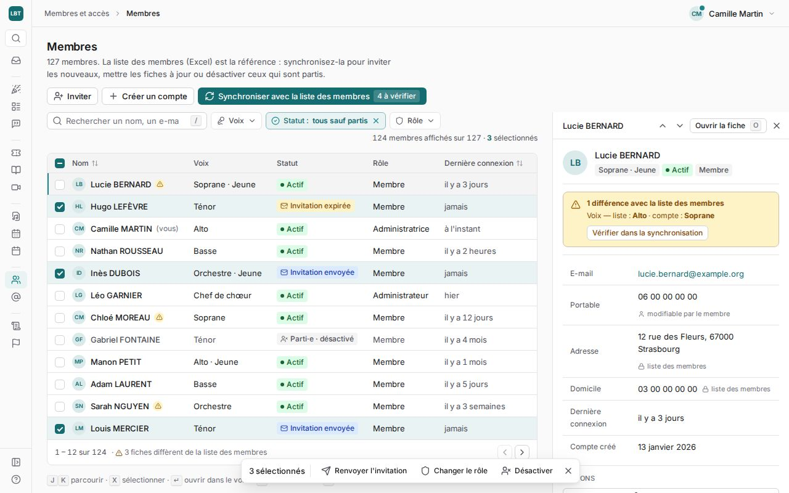 | 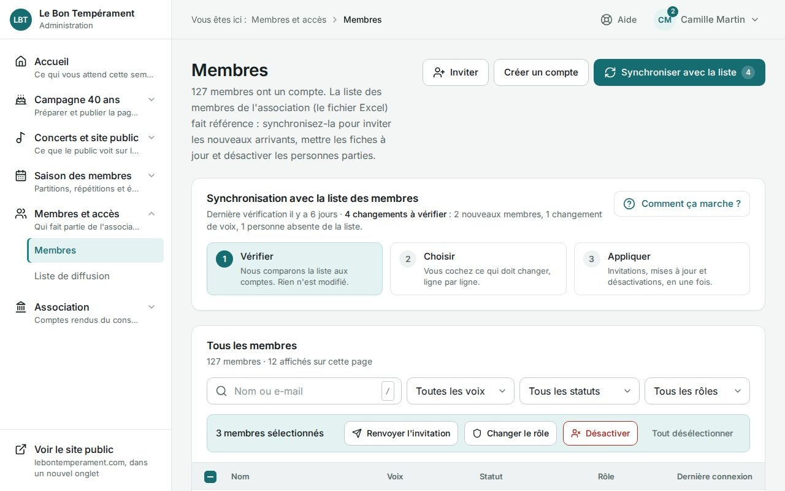 | 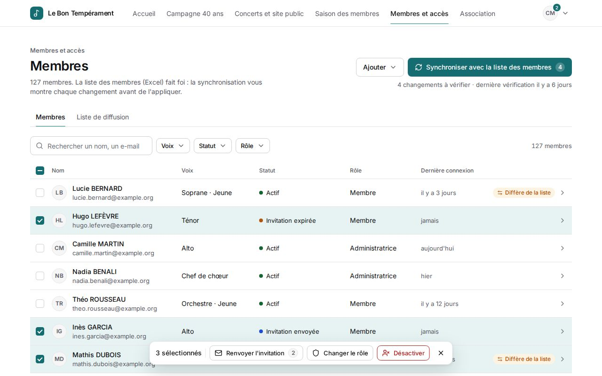 |

**Nouveau concert** (after a submit with three errors)

| A — Console                                                               | B — Atelier guidé                                                         | C — Canevas                                                              |
| ------------------------------------------------------------------------- | ------------------------------------------------------------------------- | ------------------------------------------------------------------------ |
| 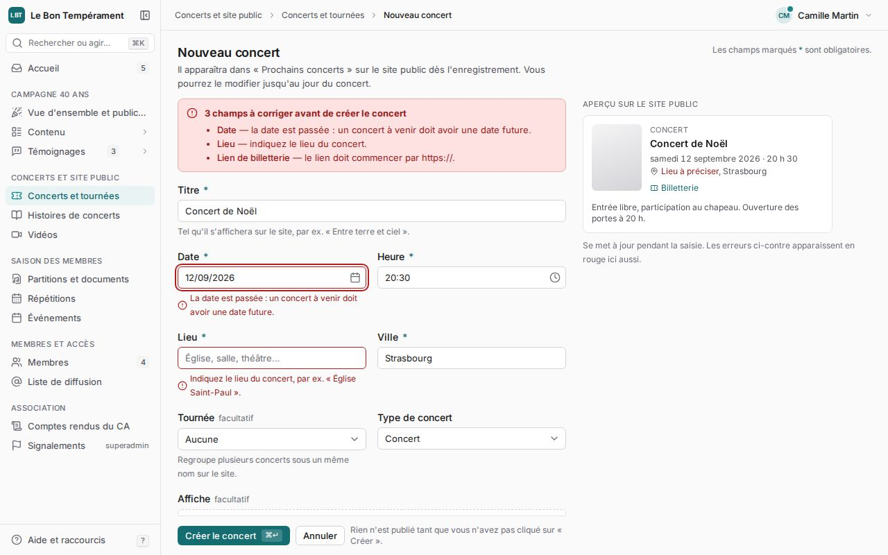 | 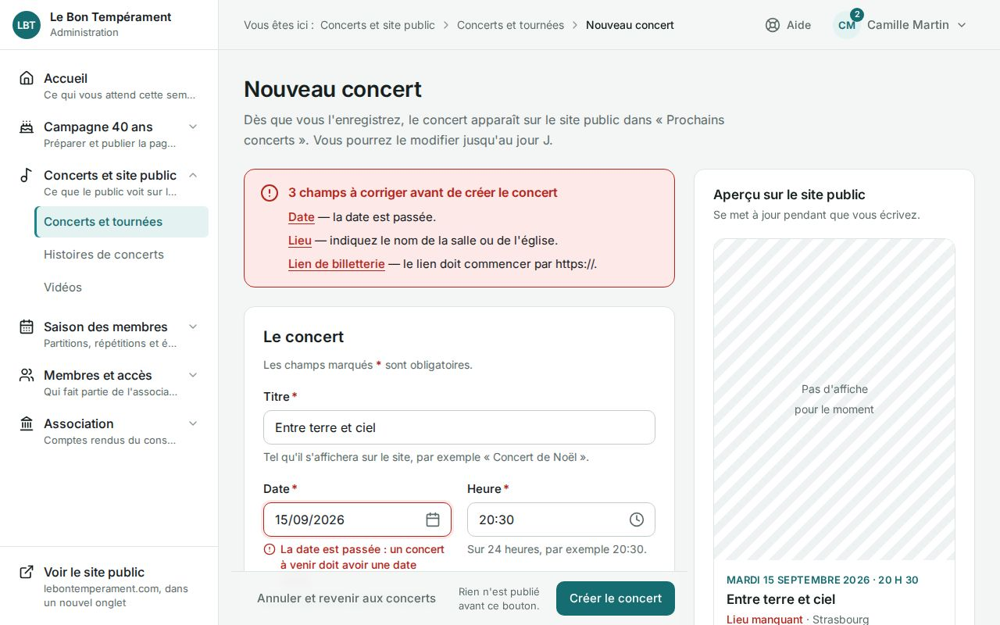 | 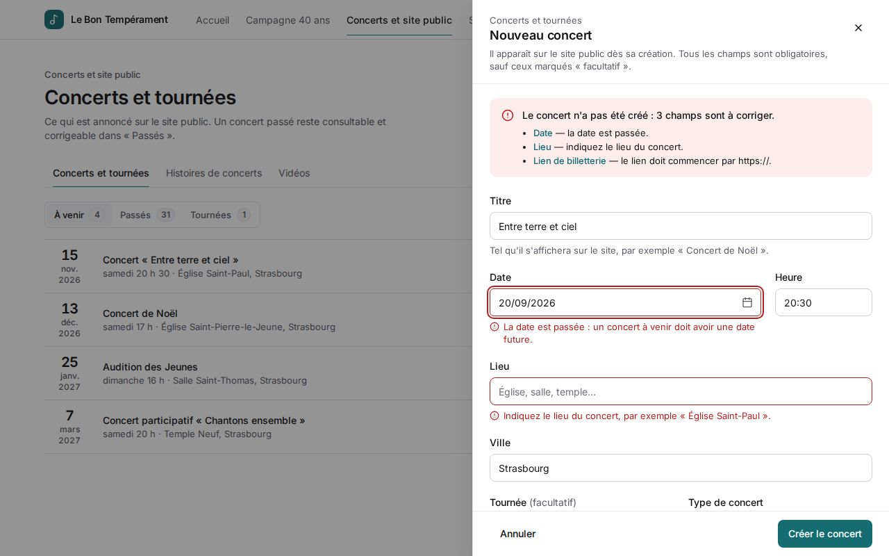 |

**Fiche membre**, deactivation dialog open

| A — Console                                                                    | B — Atelier guidé                                                              | C — Canevas                                                                   |
| ------------------------------------------------------------------------------ | ------------------------------------------------------------------------------ | ----------------------------------------------------------------------------- |
| 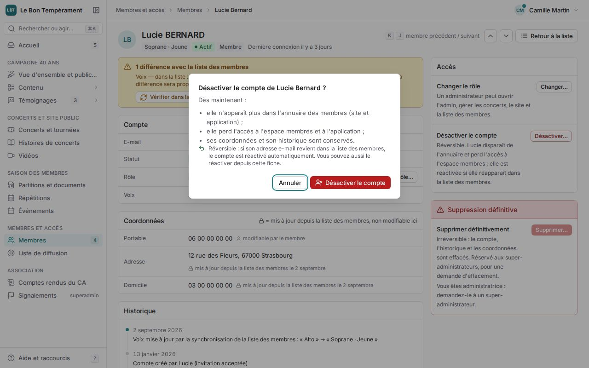 | 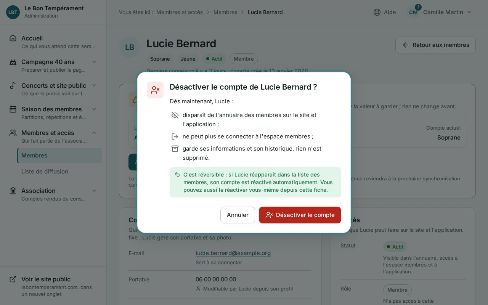 | 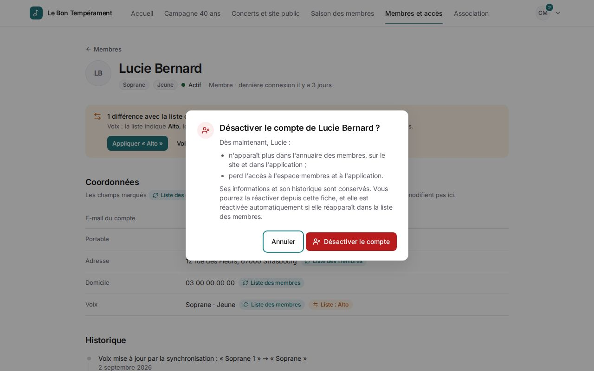 |

Dark mode and mobile versions of every screen use the same file names with `desktop-dark` and `mobile-light`.

## Recommendation: B — « Atelier guidé », with two borrowings

**Why B.**

- **The users are occasional.** The admin is used by about ten volunteers of the communication commission, some of whom open it once a month. B is the only direction designed for them first: every page explains itself in one sentence, and the sidebar descriptions teach the new structure.
- **The riskiest work is "review, then apply".** That covers the roster sync, the Drive sync and the campaign publication. B gives that flow a shape, Vérifier · Choisir · Appliquer, that is reused everywhere, and that is exactly how the functional rebuilds (F2, F3, F5) are designed.
- **The campaign is the priority until early 2027.** B's readiness checklist with progress on the Accueil keeps it visible without a dedicated dashboard.

**What it costs, and how B absorbs it.** Pages are taller and the copy must stay true as features change:

- the "Compactes" switch and sticky action bars keep frequent use quick;
- the copy lives in one place (`lib/navigation.ts` and the page headers), so it's maintained with the features.

**Two borrowings, the owner's call:**

1. **From C: the detail sheet on lists.** On Membres (and later the campaign content lists), a row click opens a right-side sheet with the essentials. Deactivation and deletion stay on the full fiche page. It keeps people in their place and avoids page hops, without C's top-tab navigation.
2. **From A, later and optional: the ⌘K command palette** as an accelerator for regulars. It needs `cmdk`, a new runtime dependency, so it's proposed for Phase 5 only if the owner agrees. Nothing in B depends on it.

**Why not A or C as the base.**

- A optimises for weekly volume that this admin doesn't have, and its density is the opposite of what the Phase 0 audit asked for.
- C is the calmest and best on phones, but puts the campaign two clicks deep, and its URL-synced sheets are the most complex piece to build and to keep accessible.

## What the owner decides

1. **The base direction:** A, B or C.
2. **Borrowings:** none, the detail sheet from C, and/or the command palette from A (which needs `cmdk`).
3. Anything in the chosen direction's screens to change before Phase 2.

Phase 2 (design-system foundation: tokens, theme layer and `ThemeProvider`, `components/ui`, `data-state.tsx`, `PageShell.tsx`, no behaviour change) starts from that answer.
